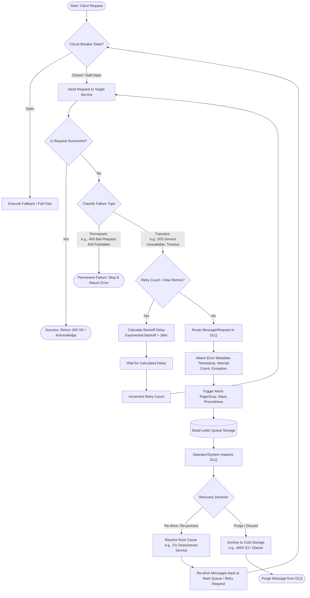

# Failure Lifecycle Flow Diagram

This document provides a visual representation of the end-to-end request lifecycle, detailing how failures are classified, how the retry mechanism (with Exponential Backoff & Jitter) operates, how the Circuit Breaker interacts with the flow, and how permanently failed requests are routed to and recovered from the Dead-Letter Queue (DLQ).

---

## 📊 End-to-End Failure Lifecycle

---

## 🔍 Key Stages Explained

### 1. Circuit Breaker Check
Before sending the request, the client or gateway checks the state of the **Circuit Breaker** protecting the target service.
- **Closed**: Requests flow normally.
- **Open**: The service is known to be failing; the request is intercepted immediately to prevent overloading the downstream system (Fail-Fast).
- **Half-Open**: A limited number of trial requests are allowed through to see if the service has recovered.

### 2. Failure Classification
When a request fails, it is immediately classified:
- **Transient Failures**: Intermittent issues (e.g., rate limits, network packet loss, temporary database locks). These are suitable for retries.
- **Permanent Failures**: Logic or input errors (e.g., validation errors, missing resource, authentication failure). Retrying these would yield the same result and waste resources.

### 3. Retry Loop with Exponential Backoff and Jitter
If the failure is transient, the system delays the next attempt. The delay grows exponentially to allow the downstream system time to recover, and "Jitter" (randomness) is added to prevent **Thundering Herd** scenarios (where all retrying clients hit the server at the exact same millisecond).

### 4. Dead-Letter Queue (DLQ) Routing
If all retries are exhausted without success, the request is marked as dead. Instead of silently dropping it, the system moves the request payload along with comprehensive error metadata (stack traces, attempt counts, timestamps) into the **Dead-Letter Queue (DLQ)**.

### 5. Recovery & Re-drive
Once in the DLQ, messages remain isolated until an operator or automated script takes action:
- **Resolve Root Cause**: The underlying issue is fixed (e.g., database scaled up, bug patched).
- **Re-drive**: Messages are re-routed back into the main processing queue to be processed successfully.
- **Archive**: Unprocessable messages are stored in cold storage for post-mortem analysis and purged from the DLQ.
